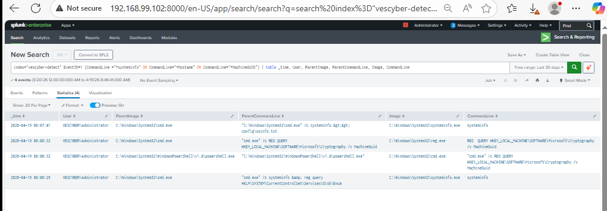

# T1082 – System Information Discovery

## Overview

This scenario simulates adversary reconnaissance behavior aligned with **MITRE ATT&CK T1082 – System Information Discovery** using Atomic Red Team in a home SOC lab environment.

The objective was to generate host discovery activity on a Windows 10 endpoint and validate detection visibility through Sysmon logs in Splunk.

---

## Technique Information

- **Technique ID:** T1082  
- **Name:** System Information Discovery  
- **Tactic:** Discovery

---

## Lab Systems

- **Windows 10 Endpoint:** `192.168.99.120`
- **Splunk Server:** `192.168.99.102`
- **pfSense Firewall:** `192.168.99.100`

---

## Attack Simulation

Atomic Red Team was used to emulate host reconnaissance activity.

```powershell
Invoke-AtomicTest T1082
```
Executed sub-tests generated multiple discovery commands including:

```systeminfo```
```hostname```
```Registry queries for MachineGUID```

## Telemetry Source
Sysmon Event ID 1 – Process Creation


## Splunk Detection Query
```
index="vescyber-detect" EventCode=1 
(CommandLine="*systeminfo*" OR CommandLine="*hostname*" OR CommandLine="*MachineGUID*")
| table _time User ParentImage Image CommandLine
```

## Detection Evidence

Search Results


Event Details


## Key Observations

Observed reconnaissance behavior included:

Execution of systeminfo.exe
Hostname discovery
Registry queries for unique host identifiers
Command shell spawning discovery tools

A notable event showed:

```ParentImage: cmd.exe```
```Image: systeminfo.exe```
```CommandLine: systeminfo```

This pattern may indicate attacker enumeration following initial access.

## MITRE ATT&CK Mapping
T1082 – System Information Discovery
