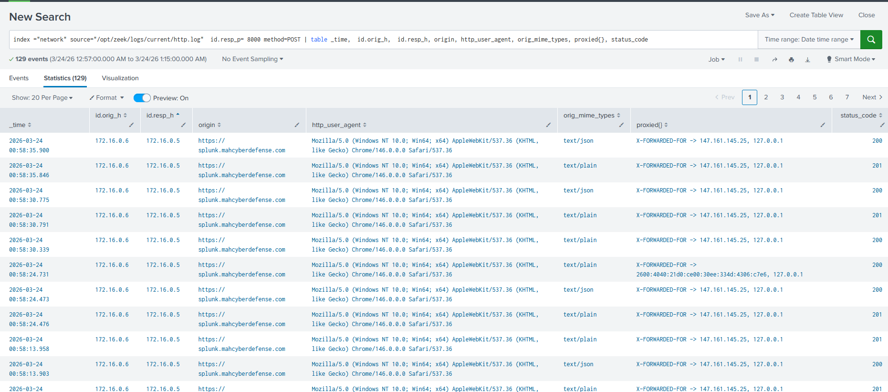
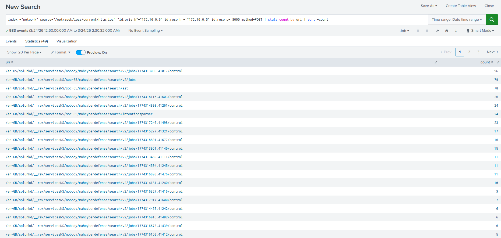
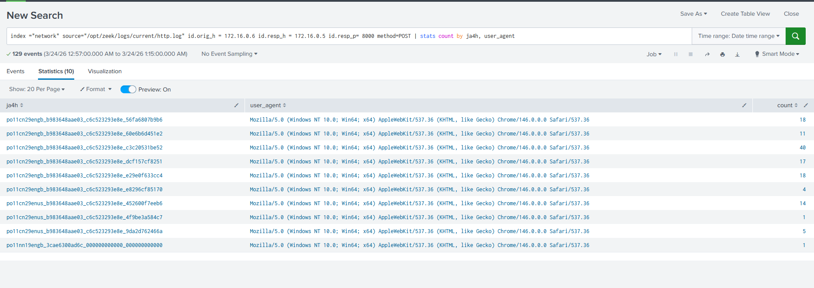
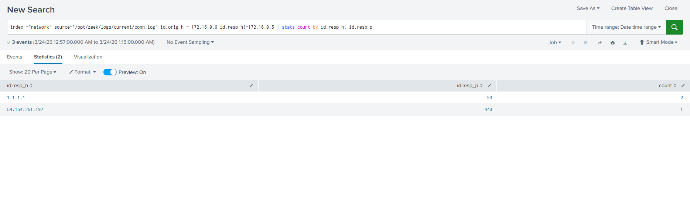
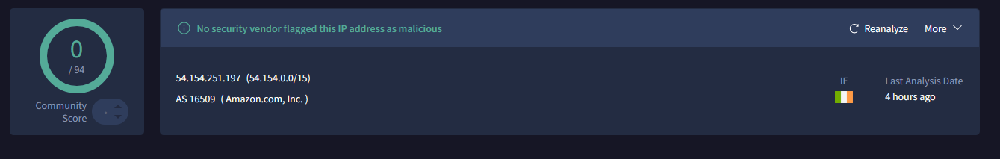
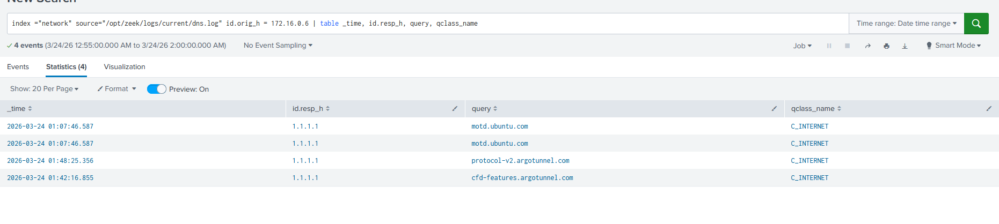

# Investigation:

## HTTP Analysis: 
A total of 129 HTTP POST requests were observed over port 8000 between the first occurrence and the alert trigger time. Although the volume is relatively high, the requests do not follow a fixed or periodic interval. This suggest normal user based activity. The requests were generated by a legitimate user agent (Chrome 146 on Windows 10) and were used to submit data in text/json format to the Splunk server on 172.16.0.5. The server returned expected responses.
Analysis of the HTTP headers reveals the original sender is 147.161.145.25, as indicated by the X-FORWARDED-FOR header. The host 172.16.0.6 acts as a proxy server forwarding the requests to the backend Splunk server. OSINT analysis did not flag the external IP as malicious; however, internal validation is recommended to confirm whether this IP is authorized to access the Splunk environment.

 
Due to logging limitations, the exact HTTP request body (plain text/JSON payload) is not available. However, analysis of observed URIs confirms legitimate Splunk functionality. For example:
"/en-GB/splunkd/__raw/servicesNS/soc-65/mahcyberdefense/search/ast"

This endpoint corresponds to a valid Splunk backend API used to process search queries. The /ast component refers to Abstract Syntax Tree parsing, indicating that Splunk is validating and interpreting a user-submitted search query. 

 

## Network Analysis:

JA4 fingerpriting supports the observed traffic is legitimate. All the JA4H hashes share same prefix consistent with the same user agent (Chrome 146 on Windows 10). The shared prefix of po11cn29engb_b983648aae03_c6c523293e8e indicates browser type pattern. The suffix is different becaues of different request structure. The JA4T hash is consistent with Chrome TCP stack, further supporting normal client behavior and no use of scripting tools

 

Port 8000 is commonly used for web applications and REST APIs, also it is the default port for Splunk web UI and backend services.

172.16.0.6 established a single external connection to 54.154.251.197, which was not flagged as malicious through OSINT checks.
 

## DNS Analysis: 

No suspicious DNS queries were observed during the investigation period. All observed queries are towards legitimate DNS server 1.1.1.1 with no signs of malicious or newly created domains. The query behavior does not appear to be linked to any tunneling or beaconing.
 

## Final assesment:
No evidence of curl or scripted HTTP activity, malicious network behavior, suspicious DNS queries, file transfers. The observed activity is consistent with legitimate internal application communication (likely Splunk-related traffic). The alert is a false-positive.

### WHO - 172.16.0.6, 172.16.0.5
### WHAT - HTTP POST requests flagged as suspicious due to curl-like patterns in the request body 
### WHEN - 2026-03-24 00:57:39 UTC (first observed). 
### WHERE: Internal web server KCD-WEB (kerningcitydental.ca)
### WHY: The alert was triggered by suricata detection rules which identify strings which may contain curl commands in legitimate POST requests 
### HOW: The POST requests contained query data which have matched Suricata's detection rules

## Recomendations:

1) Tune suricata's detection rules to lower the false-positives by excluding internal Splunk traffic

2) Consider whitelisting of known, trusted internal ports such as port 8000.

3) Consider an allowlist of internal services and their behavior, this will lower false positives.

