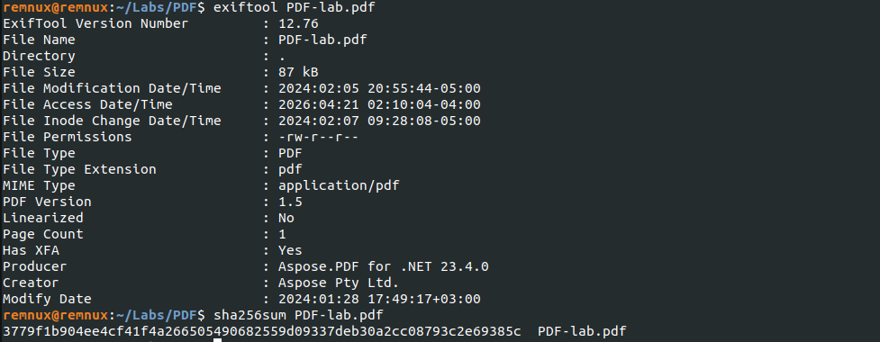
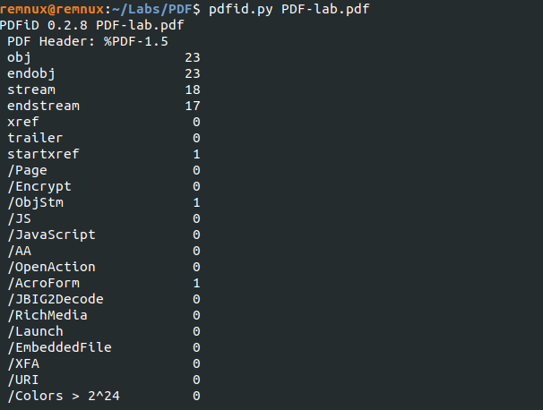
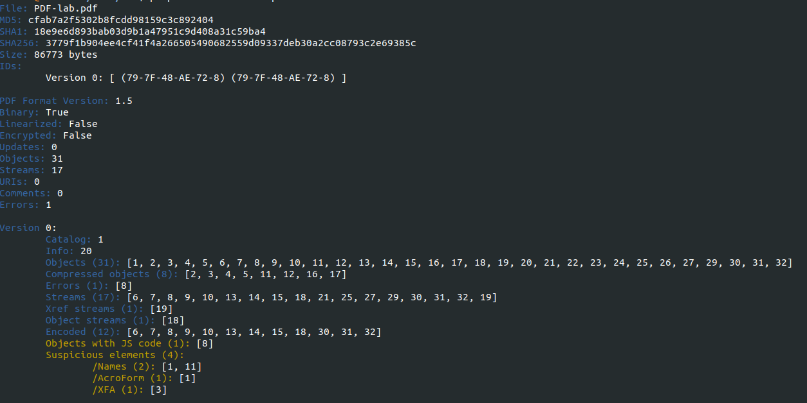

# PDF Static Analysis – Stealc Loader Delivery Document

## Overview

This investigation analyzes a malicious PDF sample used to deliver malware through embedded scripts and PowerShell execution.

The document contains malicious logic designed to download and execute a secondary payload while establishing persistence through the Windows Startup folder.

---

## Sample Information

| Field | Value |
|------|------|
| File Name | PDF-lab.pdf |
| File Type | PDF |
| SHA256 | `3779f1b904ee4cf41f4a266505490682559d09337deb30a2cc08793c2e69385c` |
| Analysis Type | Static Analysis |
| Suspected Family | Stealc Loader / Infostealer |
| Source | Training Lab |



---

## Tools Used

- ExifTool
- PDFiD
- PeePDF
- VirusTotal

---

## Initial Triage – PDFiD

PDFiD identified suspicious structural elements commonly associated with weaponized PDF files.

Notable findings:

- `/AcroForm`
- `/XFA`
- Multiple streams
- Encoded objects



---

## Structural Analysis – PeePDF

PeePDF confirmed the presence of suspicious objects, embedded code, encoded streams, and XFA content.

Notable indicators:

- Suspicious objects with code
- Encoded streams
- AcroForm objects
- XFA elements



---

## Embedded Malicious Script – Object 7

Object 7 contains script logic that invokes PowerShell to retrieve a payload from an external domain.

### Execution Chain

```text
PDF → JavaScript → PowerShell → Download EXE → Startup Folder → Execute
```

Domain Contacted - brazilanimalshelp[.]com

Payload Downloaded - stale.exe

Renamed To SecurityUpdate.exe

The payload is copied into the Windows Startup folder, strongly indicating persistence behavior.

### Additional Payload Logic – Object 8

Object 8 contains logic that creates an HTA file inside the Startup directory.

Created file : officeupdate.hta

This may serve as an additional execution or persistence mechanism.

Reputation Check – File Hash

The file hash is detected by multiple vendors as malicious.

Observed labels include:

trojan
downloader
powershell
phishing

Reputation Check – Domain IOC

The contacted domain also shows malicious reputation indicators.

brazilanimalshelp[.]com

## Indicators of Compromise (IOCs)

| Type | Value | Description |
|------|------|-------------|
| SHA256 | `3779f1b904ee4cf41f4a266505490682559d09337deb30a2cc08793c2e69385c` | Malicious PDF sample |
| Domain | `brazilanimalshelp[.]com` | Remote infrastructure used for payload delivery |
| Filename | `stale.exe` | Downloaded executable payload |
| Filename | `SecurityUpdate.exe` | Renamed payload stored for persistence |
| Filename | `officeupdate.hta` | Additional HTA file created in Startup folder |
| Path | `%APPDATA%\Microsoft\Windows\Start Menu\Programs\Startup\` | Persistence location |


## MITRE ATT&CK Mapping

| Technique ID | Technique Name | Why It Applies |
|-------------|----------------|----------------|
| T1204 | User Execution | User must open the malicious PDF |
| T1059.001 | PowerShell | Embedded script launches PowerShell |
| T1105 | Ingress Tool Transfer | External payload is downloaded |
| T1547.001 | Startup Folder | Payload copied to Startup folder |
| T1218 | Signed Binary Proxy Execution | Possible HTA execution via trusted binaries |

## Verdict

This PDF functions as an initial-stage malware delivery document. It uses embedded scripting to launch PowerShell, download an external executable, store it in the Startup folder for persistence, and execute the payload.
The creation of an additional HTA file and use of deceptive filenames further indicate malicious intent.
The sample demonstrates a realistic loader chain commonly associated with infostealer delivery campaigns such as Stealc.
