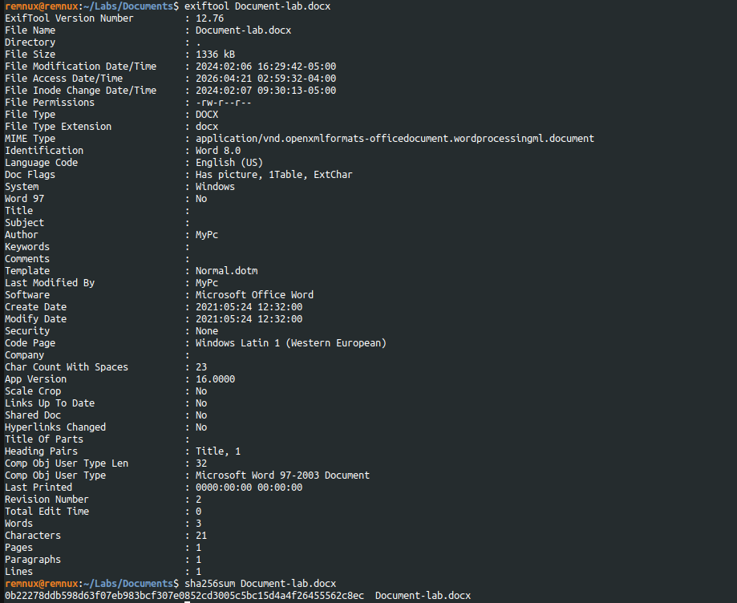
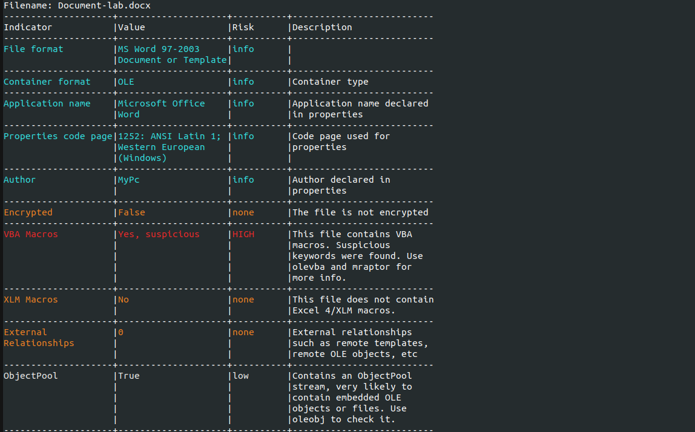
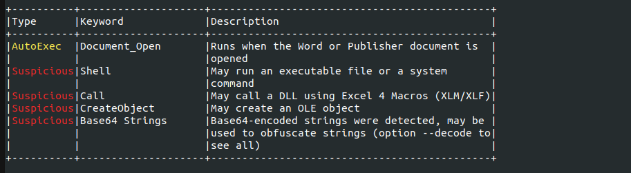

# DOCX Static Analysis – Malicious Macro Loader (Hancitor)

## Overview

This investigation analyzes a weaponized Microsoft Word document containing malicious VBA macros and an embedded payload.

The sample uses **AutoExec macro execution** to trigger when the document is opened, abuses **rundll32.exe** to execute a dropped DLL, and contains an embedded object extracted during analysis.

Based on behavioral indicators and OSINT references, the sample is consistent with **Hancitor / Chanitor** style malware delivery campaigns.

---

## Sample Information

| Field | Value |
|------|------|
| File Name | Document-lab.docx |
| File Type | Microsoft Word Document |
| SHA256 | `0b22278ddb598d63f07eb983bcf307e0852cd3005c5bc15d4a4f26455562c8ec` |
| Analysis Type | Static Analysis |
| Suspected Family | Hancitor / Chanitor |
| Initial Vector | Malicious Office Document |



---

## Metadata Analysis – ExifTool

Metadata revealed several useful indicators:

- Author: `MyPC`
- Template: `Normal.dotm`
- Created: `2021:05:24 12:32`
- Microsoft Word document format
- Legacy OLE structure present

The use of **Normal.dotm** may indicate macro-enabled templating behavior.

---

## Initial Triage – OleID

OleID confirmed the file contains suspicious VBA macros and is not encrypted.

Key findings:

- VBA Macros: Yes
- Encryption: No
- ObjectPool present
- Suspicious structure



---

## Macro Analysis – Olevba

Olevba detected multiple suspicious indicators inside the document macro code.

### Findings

- `Document_Open` AutoExec trigger
- `Shell` execution
- `Call`
- `CreateObject`
- Base64 strings
- Potential OLE abuse

This means code runs automatically when the victim opens the document.



---

## Decoded Strings

Running `olevba --decode` revealed decoded strings including:

```text
rundll32
```

This strongly suggests LOLBin abuse using a trusted Windows binary.

## Macro Behavior Review

The macro in ThisDocument contains logic that:

Executes on document open
1. Creates / manipulates files
2. Uses rundll32.exe
3. Loads a DLL-like file named: ket.t
4. Calls exported function: **EUAYKIYBPAX**
5. Observed Command Pattern ```rundll32 <path>\ket.t,EUAYKIYBPAX```

This is a common malware execution technique used to hide behind legitimate Windows binaries.

## Embedded Object Discovery – Oledump

Oledump identified both macro streams and embedded object streams.

Important Streams:

8	VBA Macro Code

16	Embedded Object / Payload

The presence of both macro code and embedded objects confirms a staged delivery mechanism.

## Extracted Embedded Payload

| Field | Value |
|------|------|
| Extracted File Name | `embeddedfile.txt` |
| Extracted File SHA256 | `2a8b737a4752060a308c4312b7c0cf6c05cde5b370906286dea9cdd36f5aa613` |
| Detection Status | Malicious |
| File Type | DLL / Binary |
| Threat Categories | Trojan, Downloader, Loader |
| Family Labels | Hancitor, Zusy, Bysmem |
| Execution Method | `rundll32.exe` |
| Export Function | `EUAYKIYBPAX` |

## Indicators of Compromise (IOCs)

| Type | Value | Description |
|------|------|-------------|
| SHA256 | `0b22278ddb598d63f07eb983bcf307e0852cd3005c5bc15d4a4f26455562c8ec` | Original malicious Word document |
| SHA256 | `2a8b737a4752060a308c4312b7c0cf6c05cde5b370906286dea9cdd36f5aa613` | Extracted embedded payload |
| Filename | `Document-lab.docx` | Initial phishing attachment |
| Filename | `embeddedfile.txt` | Extracted embedded payload |
| Filename | `ket.t` | DLL-like payload loaded via rundll32 |
| Process | `WINWORD.exe` | Parent process opening document |
| Process | `rundll32.exe` | LOLBin used for payload execution |
| Function | `EUAYKIYBPAX` | Export function executed by rundll32 |
| Macro Trigger | `Document_Open` | Auto-execution macro |
| Author | `MyPC` | Metadata artifact |

## MITRE ATT&CK Mapping

| Technique ID | Technique Name | Why It Applies |
|-------------|----------------|----------------|
| T1204.002 | User Execution: Malicious File | Victim opens malicious Word document |
| T1059.005 | Command and Scripting Interpreter: Visual Basic | VBA macro execution |
| T1218.011 | Signed Binary Proxy Execution: Rundll32 | Trusted Windows binary used to run payload |
| T1566.001 | Phishing: Spearphishing Attachment | Common Office document delivery vector |
| T1027 | Obfuscated Files or Information | Encoded strings and hidden logic |
| T1105 | Ingress Tool Transfer | Payload delivered from embedded object |
| T1204 | User Execution | User interaction required |

## Malware Context – Hancitor

Hancitor (also known as Chanitor) is a malware loader active since 2013. It commonly spreads through phishing emails containing weaponized Office documents with malicious macros.
Its purpose is typically to gain initial access, execute payloads, and deploy additional malware.
This sample strongly aligns with that delivery model.

## Verdict

This DOCX file is a malicious macro-enabled Office document designed to execute code when opened.
The document uses VBA macros, launches rundll32.exe, extracts an embedded payload, and executes malicious functionality using a disguised DLL.
The combination of AutoExec macros, LOLBin abuse, and embedded malware makes this a strong example of real-world malware delivery tradecraft.
